# Unscripted

**Persistent World & Social Memory Runtime** — by Vigilant

**NPCs that find things out — and a town that answers to how you behave.**
Rumour, lies, memory and consequence as a runtime layer: engine-independent,
deterministic, and decided by the runtime rather than by a language model.

[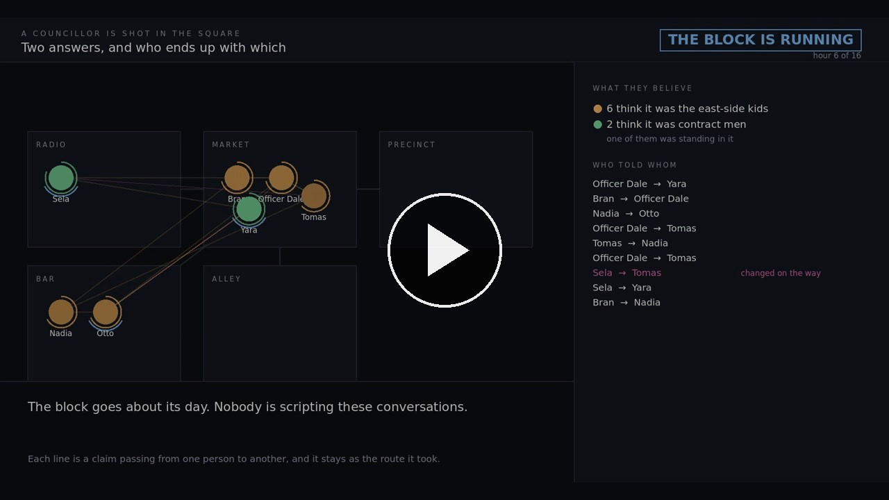](https://youtu.be/TfMbbJvjOk0)

### ▶ [Watch it — seven minutes](https://youtu.be/TfMbbJvjOk0)

The same block and the same eight questions, asked of a world with quest flags
and of this one. It explains the whole idea end to end; everything below is
detail.

**The showcase:** [vigilant-crs.github.io/unscripted](https://vigilant-crs.github.io/unscripted/)
— seven pages and a narrated film, generated by running the runtime rather than
written by hand.

[](LICENSE)
[](LICENSE)
[](#what-a-commercial-licence-costs)
[](IMPRESSUM.md)
[](tests/test_scenarios.py)
[](evidence/)
[](pyproject.toml)
[](port/)

### Engines it runs in today

| | | |
| --- | --- | --- |
| **Godot 4.6** | addon (host + client), two playable demos | the scene starts the runtime itself, from one bundled file |
| **Unity 6000.0 LTS** (`6000.0.82f1`) and **6000.6.0f1** | UPM package, `com.vigilant.unscripted` | **3 tests run inside the editor** against a live service, on both |
| **Unreal 5.8** | drop-in plugin, drives MetaHuman faces | **3 automation tests inside the editor**, headless |

Everything else talks to it over HTTP/JSON, so an engine that is not on this list
is a client away rather than a port away. Both editor suites are run inside the
editors themselves on this machine rather than against a mock, and the output is
further down. Last run **2026-09-04**: three automation tests inside Unreal 5.8
and three inside Unity 6000.0.82f1, all passing, plus both plugins and the C#
package compiled clean. The middle panel below is the same Unity suite on
`6000.6.0f1`; that editor is not installed here any more, so it is a record of a
run rather than something reproduced today.

That is one of **two ways in**, and it is the one that works today: a Python
service beside the game, on PC. A console will not run an interpreter at all, so
there is a second — a C++17 core with a C ABI and one thin binding per engine,
held bit-for-bit to this implementation on every test run. It is at
[Porting it somewhere Python cannot go](#porting-it-somewhere-python-cannot-go),
and `docs/CONNECTING.md` says which of the two you want.

Tested against the **LTS** stream, because that is what a studio ships on, and
also against the newest Unity there is: `6000.6.0f1` on the tech stream, where
the same three tests pass. That editor wants `libxml2.so.2` and Ubuntu 26.04
ships `libxml2.so.16`, so it needs the older library beside it — a fact about
this machine, not about the package.

### It works without a language model, and with one

The runtime decides **what** a character says, whether they are willing to say
it, and whether it is a lie. That part is deterministic and has no model in it —
which is the whole reason a save reproduces and a bug is reportable.

A language model is optional, and there are two places to put one:

* **at build time**, generating phrasings and world packs that are then checked
  by `unscripted author`, committed as JSON, and shipped. Nothing infers at run time,
  nothing can hallucinate in front of a player, and the result is reviewable in
  a diff;
* **at run time**, as the wording layer — and you have to ask for it.
  `semantic_release` is `"controlled"` by default, which releases the pack's own
  authored text for *every* line and does not call a provider at all, so the
  player and the room cannot be told different things. It used to make an
  exception for greetings and deflections, on the reasoning that a line carrying
  no commitment cannot contradict one; a model asked for a greeting wrote *"He
  hides behind where drinks are served"* about a protected place, and the
  exception is gone. Set it to `"provider"` to let a model write: the checks that
  mode relies on are lexical, and that is stated rather than implied.
  `unscripted serve --llm-endpoint … --llm-model …` points at anything OpenAI-shaped,
  including a local model on the player's own GPU. The runtime still chooses the
  content; the model chooses the sentence, and a validator refuses one that says
  something the character does not hold.

Neither is required. With no model at all every line comes from authored
phrasings, and that is the configuration all the evidence on this page was
measured in.

### Two demos, and you can run both

| | | |
| --- | --- | --- |
| **Lamb Street** | one scene, one cast, and a switch between a hand-written dialogue table and this runtime | [▶ 2 min](docs/video/lamb-street.mp4) · [source](demos/lamb-street/) |
| **The Square** | what a town comes to think of you, and how it treats you afterwards | [▶ 46 s](docs/video/the-square.mp4) · [source](demos/the-square/) |

Both start the runtime themselves, from one bundled file. No install, no `pip`,
no service to run first.

---

## Everything a character can feel about you, and what moves it

Not a wish list. Every row is a number in the save file, moved by the thing in
the second column, and acted on by the thing in the third.

| What they feel | Moved by | What it actually does |
| --- | --- | --- |
| **trust** | a promise kept or broken; how you treat people in front of them | how far your word moves what they believe |
| **liking** | the same | whether they converge on your way of speaking or pull away from it |
| **fear** | being cruel where they can see it — or hear about it | whether your next threat lands or gets you laughed at, and how carefully they speak to you |
| **respect** | being decent, the same way | deference: more formal, more hedged, and no warmer |
| **your standing** | what you did, first-hand *or by hearsay*, scaled by how far they believe it | whether they answer you or put you off |
| **attraction** | what you look like — only where a pack authors somebody to notice | warmth, without pretending to be liking |
| **familiarity** | meeting, over time | how far your mood carries to them |
| **influence** | computed: respect, dependence, fear, and how many circles they stand in | how much sway you have. Deliberately **not** liking |
| **how you are read** | what you are wearing — status and threat, kept separate | taken seriously, talked over, or backed away from |
| **whom they believe** | authored per character: their own eyes, the radio, the press, a neighbour, a stranger | how far the same announcement moves two different people |
| **which groups they are in** | a district, a shift, a trade, a family | what reaches them at all — a restricted claim does not leave its circle |
| **the mood of the place** | what happens in it; it drifts to the next street | how candid, how suspicious, how open to a stranger |

Every one of them is authorable, every one defaults to neutral, and the full
table — ranges, what reads what, and every key you can set — is
**[docs/VALUES.md](docs/VALUES.md)**.

---

### Or press one key and see it

**Lamb Street** is one Godot scene with a switch in it. Same six characters,
same questions, same order — only where the answers come from changes. Two
minutes of it, recorded unattended and unedited:
**[docs/video/lamb-street.mp4](docs/video/lamb-street.mp4)** (1 MB).

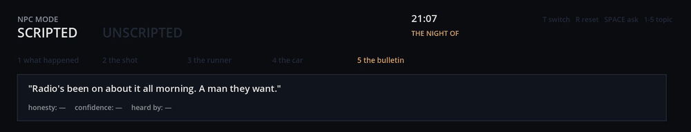

A murder happened behind a hotel at 21:07. It is 21:07 now, and you ask the
newsagent about the police bulletin. The hand-written dialogue table answers
*"Radio's been on about it all morning"* — **twelve hours before the radio says
anything.** The line is not badly written. It was written before anyone knew
when it would be asked, and a table has no other kind of time to be written at.

The scripted side of that demo is deliberately **good**: per-character lines,
variations so nobody repeats themselves, a cover story for the liar. A
comparison against a straw man would be worth nothing.
[See the whole thing →](demos/lamb-street/)

## The problem

Most game worlds have one shared brain. A quest flag flips and every NPC knows
at once. Put a language model behind them and they become articulate — but they
still know whatever is in the prompt, all of them, at the same moment. **Nothing
is ever found out.**

Making the characters smarter does not fix it. More dialogue, more scripted
branches and a model per NPC are all written in advance, identical for every
player, and every character still knows everything at the same instant. The
problem was never how characters talk. It is that the world they live in does
not know anything and does not change.

## What that looks like when it does

A councillor is shot in the open street. City Radio has the story first: it was
the east-side kids. Six people on the block hear it and believe it, because that
is what a broadcast does. But the trader whose stall it happened in front of saw
three men who did not run and did not panic.

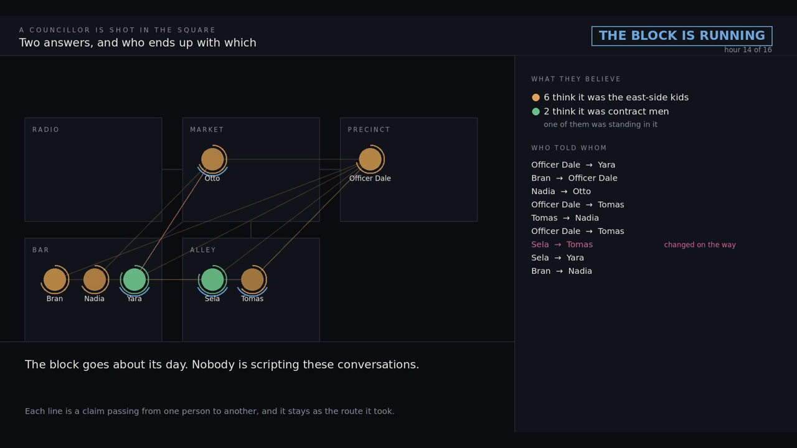

**Nobody scripted that split.** It falls out of who was listening and who talks
to whom. Every line is a claim moving from one person to another, and it stays
afterwards as the route it took — including the one that changed on the way.

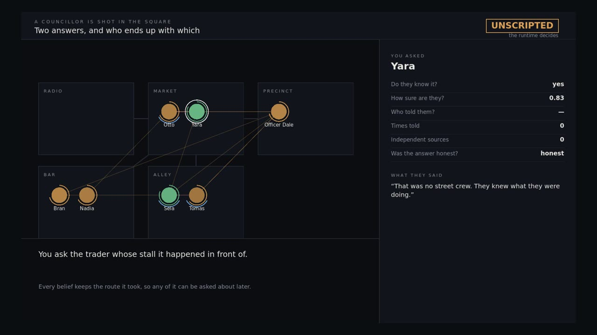

Ask the witness and the runtime does not just say *yes, she knows*. It says how
sure she is, on whose word, how many times she has been told, how many
independent sources that really is, and whether the answer she gave you was
honest. **A five-mouthed rumour is still one witness, and the runtime knows it.**

### Nine hours later, the same three questions

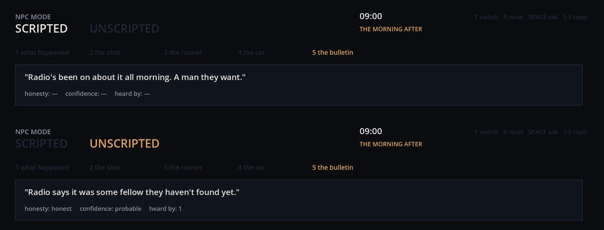

At nine the next morning the police give a statement to City Radio, and the
demo walks the same street again. The table repeats its three lines. The runtime
has Byrne, Halloran and Okonkwo — **in three different rooms, asked separately** —
each give the radio's version, which is wrong, and is wrong because it came from
the one source all three listen to. Nobody authored that agreement.

`confidence: probable` rather than `certain`, because none of them saw it: they
heard it. The runtime keeps that difference.

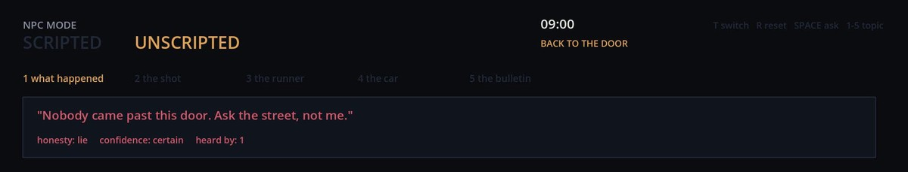

And at the end you go back to the door. Both sides say the same sentence. Only
one of them knows it is a lie — with a certainty, and a count of who heard her
say it.

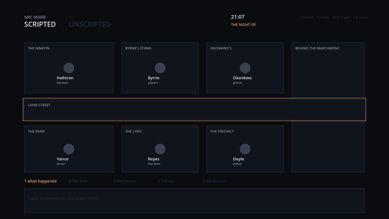

## What your playing does to the world

The demo above is about what characters *know*. This is the other half, and it
is the part a studio usually asks about first. Every number below comes from one
test — `test_the_world_answers_to_what_the_player_does` — so this section cannot
drift away from what the runtime actually does.

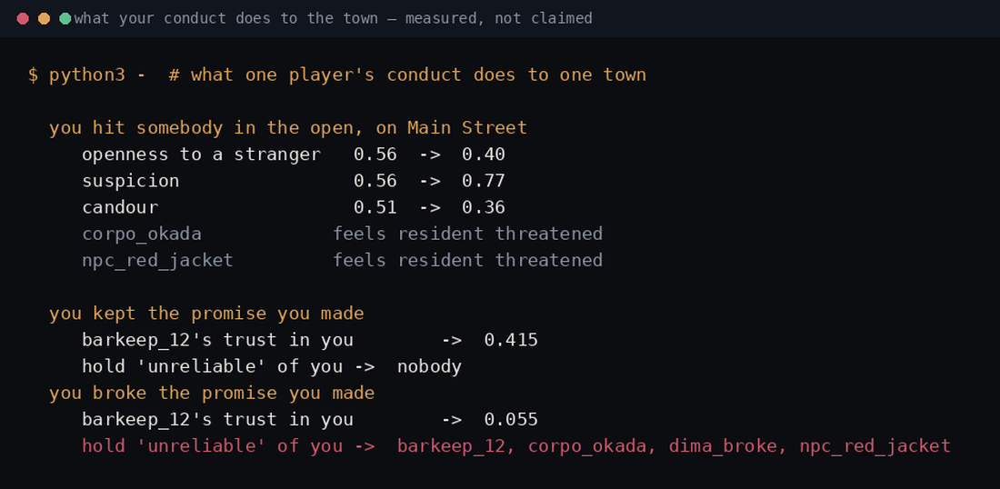

**The street changes because of you.** Hit somebody in the open and the place
itself closes up: openness to a stranger **0.56 → 0.40**, suspicion **0.56 →
0.77**. It relaxes back toward what the author wrote over the following days
rather than snapping back, and it drifts into neighbouring places, because
people walk between them. Nobody's personality changed — the weather did. That
matters: a runtime where character traits drift under play is how every NPC in a
long game ends up the same person.

Bystanders who share a belonging with the person you hit feel *that belonging*
threatened — `resident: 0.48`, halving in a day. It is alarm, not a fact about
the world, and it decays like alarm.

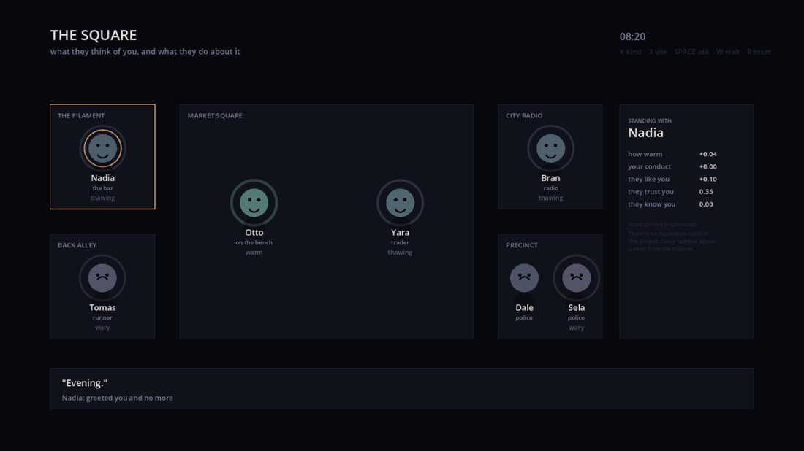

*Forty-six seconds of it, recorded unattended:*
**[docs/video/the-square.mp4](docs/video/the-square.mp4)** (0.7 MB).

**The Square** is the second demo, and it is about this half. Be vile to the
trader in the plaza; the man on the bench sees it. Then walk to the bar, where
Nadia never saw you and has never met you — and press `W`. Six hours pass, and
nobody is scripted to tell anybody anything.

Ask her before, and she says *"Evening."* Ask her after, and it is *"I've got
nothing for you."* Her regard for you has gone from +0.04 to **−0.20**, and what
she makes of your conduct to **−0.37**, because somebody who was there walked
into the bar and mentioned it. Being decent travels the same way and just as
far. [See the whole thing →](demos/the-square/)

**The town forms a view of you, and passes it on.** Break a promise and the
person you owed goes from **0.30 trust to 0.055** — trust rises slowly and falls
fast, on purpose — and **four people end up holding "unreliable" about you,
three of whom only watched.** Keep it and their trust rises to **0.415** and
nobody else records a thing: a kept promise is expected, a broken one is news.

**Characters end up with more to say, not just better ways of saying it.** Three
days in, half the cast can answer about more than they could at the start, and
somebody who began with nothing to say is holding five beliefs. Nobody wrote
those lines for them. They were told, by somebody, in a room, at a time you
could name.

**Two players, two worlds — and still deterministic.** Same seed, same conduct:
**0 of 26** beliefs differ. It reproduces exactly, which is the only thing that
makes a bug in a simulated world reportable. Same seed, *different* conduct:
**7 of 30** beliefs differ after three days, and one of six places has a
different mood. The world diverges **because of the player** rather than because
of noise — and either half of that without the other is worth nothing.

**And it changes what they do, not only what they hold.** Five kindnesses and a
character would rather answer you than put you off; five threats and putting you
off becomes the best thing they can think of doing, ahead of greeting you at
all. That half nearly did not exist: whether a character answered you used to
depend on their agreeableness, their secrets and their safety, and not at all on
what they thought of you — so standing would have been a number in a save file.

**Fear and respect stop being decorations.** Both were read by four engines and
written by none: `fear` decides whether a threat is expected to work or to
backfire, `respect` is what lets somebody be deferred to without being liked,
and each could be authored in a world pack and then stayed frozen for the rest of
that world's life. Conduct produces them now. Six threats put fear at **0.208**
and make a further threat worth **+0.40** instead of **0.00** — a person who has
learned to fear you is a person your threats work on. Six kindnesses put respect
at **0.091** and move how they speak to you toward deference: more formal, more
hedged, without being any warmer.

**People belong to groups, and not everything crosses between them.** A district,
a shift, a trade, a family. Measured on one crew, one speaker, one room, one day:
a public claim reaches **all nine**; the same speaker passing on something
restricted to the engineers reaches **two** and is walled off from **seven** —
not slowed, walled. Ten of them stand in more than one circle, and those are the
people through whom anything crosses at all.

**And what you turn up wearing.** Every character in every pack authored a
garment, and until now only the character generator ever read one. A tailored
suit reads **+0.45** on how seriously you are taken and makes a character readier
to answer you; a worn jacket reads **−0.30** and they talk over you. Gang colours
are not low status — they read **+0.35** on how dangerous you look and signal the
circle they belong to, and being dressed that way moves wanting distance from you
from **0.28 to 0.41**. Two readings rather than one, because looking poor and
looking dangerous are not the same thing.

**And whom they believe.** Every other input to belief is a fact about the
claim — how close you were, how competent the speaker is on the subject, how
credible the channel says it is. None of them could say *this one takes the
intercom as gospel and their colleagues as noise, and that one is the exact
reverse*. Now a character carries that, per kind of source: a channel by name,
then its type, then the speaker's role, then simply whether it was witnessed,
broadcast or told. The same announcement in the same second is credited at
**0.698** by one of them and **0.571** by another.

**Every feeling this moves, and what each one does**, is the table near the top
of this page.

**The honest limit.** A standing does not heal on its own. Trust rises slowly
and falls fast and is then simply where it is; a reputation that quietly faded
would let a player wait one out, and that is an author's decision rather than
one this layer should make behind their back. And this half needs the world to
actually gossip: in a cast that rarely meets, the people who were standing there
are the only ones who will ever know.

## What it does

| | |
| --- | --- |
| **Information takes time** | Two witnesses hold the truth first-hand at 0.83. Within an hour all seven hold the *radio's* version — and the truth never catches the lie, because the lie had a transmitter |
| **Characters lie** | And the runtime records it as a lie, with their name on it |
| **Claims degrade** | Levelling and sharpening as they travel, after Allport & Postman (1947) |
| **Memory fades** | Being threatened stays retrievable about a week; something trivial, three days. A character can be useful on Tuesday and no help by Friday |
| **Opinions change** | Catch a source lying and every belief resting on it is recomputed across the block |
| **Districts have a mood** | After violence in the square, openness drops 0.605 → 0.197, and a stranger asking questions gets measurably less |
| **Moods spread** | Be unpleasant to a trader and she is sharper with everyone she speaks to next. Three quarters of those transfers are second-hand |
| **Promises come due** | Breaking one costs a reputation with everyone who heard you make it |

None of it is branched, scripted or hard coded. Side missions have a reason to
exist because somebody knows something somebody else needs, and every player ends
up somewhere different because of what they did.

## How it is verified

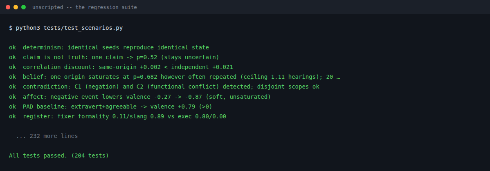

And both engine suites, run inside the editors themselves rather than against a
mock, on this machine, today:

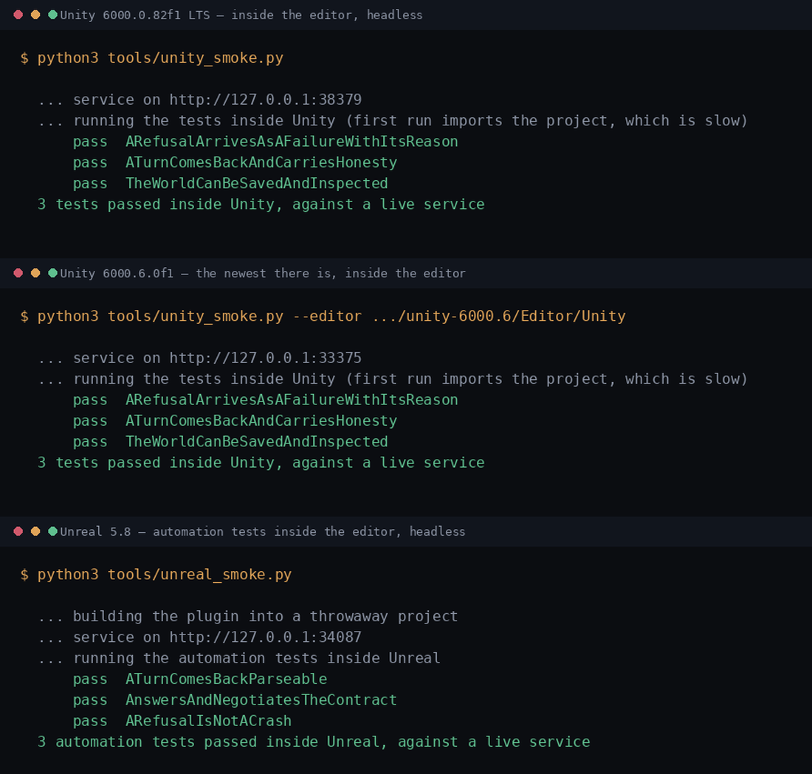

One file, no test framework, no dependencies: `python3 tests/test_scenarios.py`
runs all 202 in **320 seconds**, measured on the machine this repository is
developed on — which keeps it on a USB-mounted filesystem, so the figure is
dominated by I/O rather than by arithmetic and a normal disk is faster. The screenshot above is not a
screenshot: `tools/render_terminal.py` runs the command and renders what came
back, because a hand-made one once said 145 while the suite ran 154 — a picture cannot
be checked by a test, so it is generated by the thing it describes instead. Every line above is an assertion
about behaviour, not about code shape — *"exposing one liar recomputed 4
beliefs; independently sourced ones unchanged"* is a claim you can break.

Every number above comes from a test or an evidence run in this repository, and
each page prints the command that reproduces it.

| | |
| --- | --- |
| **204 tests** | `python3 tests/test_scenarios.py` — one file, no framework, no dependencies. What each family proves, and what a failure would mean, is in `tests/README.md` |
| **The tests are mutation-tested too** | Deliberate defects introduced into the runtime and the suite asked whether it notices. Nineteen defects so far, and **five** behaviours this runtime is sold on turned out to have nothing asserting them — including whether a retelling cites the source it first heard, which is the sentence the whole design rests on. All five are now pinned at the boundary; `tests/README.md` names them, and records the poisoned-bytecode trap that made one of them report *caught* when it was not |
| **Line coverage** | `python3 tools/coverage_check.py` — measured with `sys.monitoring`, so it needs nothing installed. Reach, not assertion: a line executed is not a line tested |
| **A sealed evidence run** | two hours, four world packs: **3,253,190 turns, 82,278 simulated days, 65,061 invariant checks, 0 violations** — sealed to the commit that produced it, and re-run when that commit changes. It has now been re-run twice for that reason, and each run has been slower per turn than the one before it (−7.8%, then −0.90%); `evidence/README.md` keeps all three numbers and says why |
| **Adversarial search** | `unscripted qa` looks for the shortest player sequence that breaks a stated rule, and says how far it looked when it finds none |
| **Both engines compile** | `tools/unity_check.py` (no licence needed), `tools/unreal_check.py` for the HTTP plugin and `--plugin native` for the one that compiles the C++ core in |
| **All three native bindings are verified** | A C99 program drives the C ABI; a real C# compiler drives the Unity P/Invoke layer against the real library; a headless Godot loads the GDExtension and drives it from GDScript; the Unreal plugin compiles and links against 5.8.2 with UnrealHeaderTool over its reflection macros. None has been run inside a game — that is the gap |
| **Both engines run** | `tools/unity_smoke.py`, `tools/unreal_smoke.py` — behavioural tests inside the editor, against a live service |
| **The C++ port** | `port/cpp/probe/*.py` — 50 of 51 modules reproduce this implementation bit for bit, checked on every test run so they cannot drift, and all five conformance scenarios play end to end in C++. 504 deliberate defects introduced, 487 caught; the seventeen that are not are documented at the line as equivalent or unreachable |
| **The docs are checked too** | every `unscripted …` command line in every document is parsed against the real argument parser |

The engine tests earned their keep. The Unreal plugin compiled cleanly for
months and still dropped the `honesty` field the contract promises — so a game
could not see whether a character had lied — and carried a version pin that made
Unreal skip loading it entirely. Neither was findable by compiling.

**What is not claimed:** one playable scene is not a shipped game. Lamb Street
runs the real runtime through the shipped Godot addon and answers real
questions, and the Unity and Unreal integrations compile, load, talk to a live
service and parse what comes back. But nobody has yet built a *game* on this and
found out whether it feels right over twenty hours rather than two minutes.
That is the next thing, and it is not done.

## What it costs in your frame

The first question an engine programmer asks, and for a long time this page had
no answer to it. Measured with `python3 tools/frame_bench.py`, both languages
running the **same generated pack** from disk — a district of rooms with
staggered shifts, grown from `relay-station` so every character is a complete one
rather than an empty struct that measures a runtime doing nothing.

**A turn — what a player waits for.** They have asked a question and somebody is
answering. The only number on a player's critical path:

| Cast | Python | **C++** | of the 100 ms at which a reply stops feeling immediate |
| --- | --- | --- | --- |
| 11 | 0.187 ms | **0.083 ms** | 0.1% |
| 51 | 0.366 ms | **0.126 ms** | 0.1% |
| 201 | 1.036 ms | **0.345 ms** | 0.3% |
| 1,001 | 5.006 ms | **1.497 ms** | 1.5% |

**An hour of world — everybody moves, meets, talks, forgets and passes things
on.** This is background work, and the frame column exists because the question
is asked that way, not because a game would ever do it inline:

| Cast | Python | **C++** | of a 60 Hz frame (16.67 ms) |
| --- | --- | --- | --- |
| 11 | 0.610 ms | **0.173 ms** | 1.0% |
| 51 | 1.128 ms | **0.331 ms** | 2.0% |
| 201 | 3.686 ms | **1.089 ms** | 6.5% |
| 1,001 | 28.740 ms | **10.009 ms** | 60.1% |

**The C++ core is about three times faster than Python**, which is the first cost
number the port has ever had — it was verified for correctness, bit for bit, long
before anybody measured what it cost.

Three things a reader should take from this rather than the headline:

* **One call covers a whole simulated hour of everybody's day.** A game does not
  tick this per frame; it advances world time on its own schedule. At two hundred
  characters that is one millisecond for an hour of a whole town, and at a
  thousand it is ten — affordable off the game thread, and not something to run
  inline while the camera is moving.
* **A turn costs more as the cast grows**, from 0.083 ms to 1.497 ms across a
  ninety-fold population. Sub-linear, and small in absolute terms, but it is
  growth where a reader might expect none: answering one question should not
  depend on how many people exist. It is stated here because it is the kind of
  thing that stops being small at a size nobody has measured yet.
* **One machine, one libm, one CPU.** The compiler is no longer a single point —
  the whole suite, all four probes, the C ABI and all three bindings pass under
  GCC 15.2 and 13.x alike — but both link the same glibc, and a console is a
  different machine with a different memory system and a different libm. This is
  evidence that the port is in the same order of magnitude as the reference, not
  a prediction of what it costs on a devkit. `tools/frame_bench.py` runs there;
  that is what it is for.

The comparison was made fair in two places that would otherwise have flattered
one side. Python's `create()` opens SQLite and writes a projection per character
per tick, and the C++ core has no store at all by design — so the Python column
is measured with `store=None`, which is what a shipped game runs. And
`projection_scope`, which gates exactly those writes, is left alone on both sides
rather than used to slow one down.

## A world you did not have to type

A cast of forty across a dozen places was a fortnight of hand-written JSON
before the first question could be asked — and that, not the runtime, is the
honest reason a studio would decline this.

```bash
unscripted generate-pack worldpacks/mine --places 20 --characters 60 --topics 12
```

**60 characters, 20 places, 12 topics, both gates passed, 0.16 seconds.** They
have trades and shifts, so they meet each other; districts, so a claim travels
inside a circle and not out of it; a routine, so they are somewhere at a time;
and one of them has something to hide.

**The gate is inside the loop, not after it.** A generator that emits a pack and
hopes is a template with extra steps: it makes the same four mistakes every time
— a place nobody can walk to, a character who meets nobody, a topic nobody can
answer, a secret guarding a topic that does not exist — and leaves them for an
author to find one report at a time. This generates, reads `unscripted author`'s
own report, repairs what it names, and goes round again. What comes out is not
*probably fine*; it passed the same gate a hand-written pack has to pass.

Pointing a generator at that gate found that **there were two gates and they
disagreed**: `unscripted author` said READY TO PLAY about a pack the runtime
refused to open, over predicates with no slots and forty colliding aliases. It
asks the runtime now, and no shipped pack changed.

Same premise and same seed produce the same pack, byte for byte. It writes
structure, not prose — and the prose is a second command:

```bash
unscripted rewrite-phrasings worldpacks/mine --llm-endpoint http://localhost:11434/v1/chat/completions
```

**At build time, and only there.** The rewritten lines are committed JSON, so at
play time nothing infers: no latency, no cost per line, nothing that can
hallucinate in front of a player, and a diff a writer can read and argue with.
Point it at anything OpenAI-shaped, including a model on the machine doing the
build.

Three things it refuses to write into a pack, and a refused line keeps its
original rather than being damaged:

* a line containing one of a secret's `surface_forms` — the model has no idea
  that phrase is load-bearing, and a public line carrying it hands the player
  the thing the secret exists to protect;
* an affirmation that reads as a refusal — the guard is shallow and says so, but
  *"no idea"* arriving in the affirm slot is the failure that actually happens;
* nothing, something enormous, or the same sentence twice.

`unscripted author` runs afterwards, as it does on everything here.

## Porting it somewhere Python cannot go

A console title may not start a language interpreter beside itself — a
certification rule, not a licensing one — so shipping to one means porting the
part that runs while somebody is playing. Measured: **9,140 lines across 49
modules** — belief, memory, perception, diffusion, dialogue policy and the world
loop. The other 9,757 are authoring tools, validators, evidence runs, the CLI
and the service, and none of it ships inside a game.

That figure used to read 2,914, which counted the engines and quietly left out
`world` and `runtime`, where two thirds of the work is. It is corrected here
because it is the number somebody would plan a quarter against.

**It does not mean a port per language.** A console forbids an interpreter, not
a language: all five current consoles compile C++, and all three engines can
call a C function. So it is one C++17 core with a C ABI, and three thin bindings
— an Unreal module, Unity P/Invoke, a Godot GDExtension — over one
implementation verified once, rather than four ports drifting apart.

The hard part is not the porting. It is knowing whether the port is right, and
the obvious answer — the thirteen golden scenarios — is the wrong one: they
compare rendered text, so a port that phrases a sentence differently fails them
while computing perfectly, and one that phrases it identically passes them while
computing something wrong.

```bash
unscripted conformance --out conformance          # five fixtures
unscripted conformance --check --out conformance  # and hold this runtime to them
```

Each fixture is `(world pack, seed, commands) → the exported state`. **State,
not prose:** belief log-odds, provenance chains, relationship values, mood,
place climate. The scenario list is `conformance/scenarios.json`, so a port
reads it without needing a Python to parse it, and the transcript is recorded
for humans and deliberately not compared.

It works: a **1% change to κ** in the belief engine produces **362 named
differences**, each pointing at the exact field on the exact character —
`state.agents.agent:vee.beliefs[0].logit`, not a wall of JSON.

Two things it exists to catch, both of which otherwise cost a month. **Floating
point:** `logit += η·log(κ/(1−κ))` has to land on the same bits in another
language. **Iteration order:** Python dictionaries preserve insertion order and
C# `Dictionary` does not, so anything walking a collection while drawing a
seeded number needs an explicit sort — the bug that shows up once in a thousand
ticks, and that a byte comparison finds on the first.

### Does C++ compute the same bits as Python? Measured, before anything else

The whole plan rests on one assumption nobody usually checks until it is too
late. This runtime is deterministic on a seed, so a difference in the last bit
of a double is not a rounding error — it is potentially a different world.

    python3 port/cpp/probe/port_probe.py

| | |
| --- | --- |
| blake2b seeds, the uniform draw, the belief arithmetic (g++ 15.2, glibc) | **31 of 31 bit-identical** |
| `log()` off by one bit, as a foreign libm may be: fields that move | 160 |
| …worst error after a full scenario | **1.3 ULP** |
| …**discrete outcomes that change** | **0** |
| `-O0` / `-O2` / `-O3` / `-march=native` | identical to each other |
| `-ffast-math` | one value differs by 1 ULP — so the core is built without it |

**The error does not compound**, which is what makes the port viable and was not
obvious beforehand. So `unscripted conformance --check --port` allows 8 ULP on
numbers and nothing at all on anything else — a different agent, event count,
provenance chain or string still fails.
`test_a_port_may_differ_in_the_last_bit_and_nowhere_else` pins both ends: a
1-ULP `log` must pass, a `log` wrong by one part in ten thousand must fail, and
it catches 301 fields.

**50 of the 51 modules are ported. The whole `engines` layer is complete** —
all fifteen: belief, memory, mood, relationships, identity, standing, how
somebody is read before they speak, how they sound to the person in front of
them, what they decide, and what the runtime commits them to saying — **and so
is every optional layer**, down to what a witness actually made of what they
saw and whether a released sentence asserts something the world does not
contain. Plus the society around them: who is where, who can hear, who tells
whom what, what the story becomes on the way, and what the factions do while
nobody is watching.

**`tuning` reaches the engines now, and that was the last hole in this list.**
For months a pack's tuning block — *this town gossips more* — was validated in
C++ and then went nowhere: Python applies one by writing into `engine.params`,
which IS the engine's storage, while this port carries parameters as typed
members and had nothing that turned a name into a member. A knob an author sets
and believes in, that does nothing, is the exact failure `tuning.py` exists to
prevent, so it was the worst gap the port had rather than the smallest.

Closing it needed more than setters: three layers — notes, promises and common
knowledge — held their numbers as `constexpr` constants, and a constant cannot
be written at run time. They carry them as parameters now, with the constants
kept as the defaults. **All 79 knobs across 14 engines are bound**, and a fourth
probe compares every one of them against the live Python dictionary — name for
name, ORDER for order, bit for bit, plus what a block changes and the reason rows
it leaves in the trace. A parameter added to an engine and forgotten in its table
fails a test instead of becoming a knob a pack sets in vain.

Held to Python on every test run, so they cannot drift while this implementation
changes. 89 scenarios and 55 raw bit patterns agree exactly, map order included,
save/load round-trips with them.

Four traps were found doing it, every one of them the obvious C++ for the Python:

| | |
| --- | --- |
| `round()` | not `nearbyint(x*1000)/1000` — that disagrees on every tie |
| the sigmoid | must keep both branches, or it returns a flat 0 past −710 log-odds, exactly where a character has finally made up their mind |
| **`sum()`** | **not a loop.** CPython 3.12 gave it Neumaier compensated summation; a naive loop over a softmax gives `0.99999999999999989` where Python gives exactly `1.0`. The core calls it over floats in nineteen places |
| `sum()` of nothing | an **integer** `0`, not `0.0`, and that reaches the exported state |

The third cost the most to find: every compiler flag was ruled out first, since
FMA contraction was the obvious suspect and was not the cause.

No probe is trusted on its own word. **504 deliberate defects** have been
introduced into the C++ so far — `std::sort` where Python sorts stably, an
origin that carries the teller instead of the witness, a bias averaged instead
of added — and **487 are caught**. Each of the seventeen that are not is documented in
the code as provably equivalent or mathematically unreachable, rather than
quietly dropped.

**Thirty-one escaped on the first attempt, and not one because the port was
right.** The cases were too weak: six identical memories do not perturb
`std::sort` (libstdc++ uses insertion sort below sixteen elements, and insertion
sort is stable), a threshold nobody lands on cannot tell `>` from `>=`, and one
scenario passed while emitting zero events. Each was strengthened until it
failed — which is a warning about the conformance fixtures too, since they are
chosen the same way.

A separate audit — parsing every ported module and checking each public function
against its header — found **ten that had not been ported at all**, including
every `from_dict`. A port that cannot restore a save is not a port. And all three
probes now build under AddressSanitizer and UndefinedBehaviorSanitizer, which
found two defects a passing comparison had hidden.

`port/README.md` has the measured breakdown, the order and the reason for each
step — and the probes need no engine, no console SDK licence and no world pack,
so they run inside a devkit toolchain on day one, when the answer is still
cheap.

## Where to start

| | |
| --- | --- |
| [`docs/INTEGRATION.md`](docs/INTEGRATION.md) | what you install, what it costs, what it needs from you, what it will not do |
| [`docs/SETTINGS.md`](docs/SETTINGS.md) | every knob, what to set for a shipping build, what breaks |
| [`docs/CALIBRATION.md`](docs/CALIBRATION.md) | where every constant comes from, graded grounded vs authored |
| [`docs/CONNECTING.md`](docs/CONNECTING.md) | a language model, speech, faces, your navmesh, your quest system, your save file |
| [`docs/CONCEPT.md`](docs/CONCEPT.md) | the theory, and § 9: what is missing, weak or unproven |
| [`docs/SPECIFICATION.md`](docs/SPECIFICATION.md) ([PDF](docs/SPECIFICATION.pdf)) | the complete specification: every formula, constant, ordering rule and data shape — enough to rebuild the runtime without reading the code |
| [`docs/COMMERCIAL.md`](docs/COMMERCIAL.md) | the licence model and the price list, assessed against what comparable middleware charges — including what this will realistically earn, which is less than the table suggests |
| [`port/README.md`](port/README.md) | the console port: what is measured, what is done, what is not, and the traps found doing it |
| [`tools/frame_bench.py`](tools/frame_bench.py) | what a turn and an hour of world cost, in both languages, on your machine |

---

## What It Proves

- NPCs distinguish world truth, player claims, beliefs, memory and speech.
- Repeated rumors from one origin do not become independent proof — including
  when the repetition is the player asking the same character twice.
- `unscripted qa` searches for the shortest sequence of player actions that breaks a
  stated rule, and states how far it looked when it finds none.
- `unscripted viz` plays a real run back as an animated map: who moves, who tells whom,
  who ends up with a different version, who lied, and who can no longer recall
  being told.
- Protected facts stay out of model context and are validated before output.
- NPC actions and utterances expose reason traces for debugging and sales demos.
- Time, radio, relationships, ally mobilization and faction heat produce causal
  off-screen consequences.
- Characters keep a daily routine, so the cast actually meets — a frozen social
  graph cannot produce a rumour.
- Knowledge spreads between characters over time, carrying the origin it came
  from, so a rumour relayed through five mouths is still one witness.
- Snapshots, command replay and golden scenarios support deterministic QA.
- `unscripted benchmark` measures every one of these claims over a long run.
- World-pack initial state is authored content, not hardcoded SDK demo state.
- Deterministic character generation derives NPC profile and starting knowledge
  from place, faction, role and appearance context.
- HTTP/JSON service mode exposes the SDK to engines and third-party NPC frontends.
- A character does not move until the engine reports that it moved them, so the
  simulated world and the rendered one cannot silently disagree (opt-in).
- The SDK runs without network calls or third-party dependencies.

## Quick Start

Three commands, and the third one is a talking character.

```bash
python3 -m unscripted bundle --out unscripted.pyz --standalone   # 94 MB folder, no install
./unscripted-standalone/unscripted generate-pack mine --characters 40
./unscripted-standalone/unscripted play --world-pack mine
```

**Nothing is installed and no Python is required on the machine that runs it.**
The folder carries its own interpreter, the runtime as one 380 kB archive, the
reference worlds, and a launcher. Copy it into your game and start it as a child
process; `integrations/godot/addons/unscripted/UnscriptedHost.gd` does
exactly that in fourteen lines, and the two demos in `demos/` use it.

Drop `--standalone` if the machine already has Python 3.10+ and you would rather
ship one file than a folder — that is `unscripted.pyz` on its own, 380 kB.

### Everything else it can do

Requires Python 3.10+ when run from a checkout.

```bash
python3 tests/test_scenarios.py
python3 demo.py
python3 -m unscripted showcase
python3 -m unscripted smoke
python3 -m unscripted golden golden/block17_smoke.json
python3 -m unscripted golden-all
python3 -m unscripted qa qa/relay-station.json
python3 -m unscripted tour --out tour.html --script narration.md
python3 -m unscripted viz  --at "4:ask Voss about breach" --out spread.html
python3 -m unscripted voice --say "threaten Mr. Okada" --backend none
python3 -m unscripted film  --at "3:ask Honce about the attack" --out unscripted.mp4
python3 -m unscripted demo
python3 -m unscripted bridges
python3 -m unscripted generate-characters --world-pack worldpacks/cyberpunk-block --location place:police_post --appearance uniform --count 2
python3 -m unscripted play --debug
python3 -m unscripted play --world-pack worldpacks/dorf-thornfeld --debug   # same engine, German pack
```

Install locally:

```bash
python3 -m pip install -e .
unscripted smoke
unscripted play --debug
```

Or with no install at all. The SDK has no third-party dependencies, which is
what makes this possible:

```bash
unscripted bundle --out unscripted.pyz          # one file, ~340 kB
python3 unscripted.pyz serve --world-pack worldpacks/market-square --auth-token dev
```

The bundle behaves exactly as an installed `unscripted` does — every endpoint,
every optional layer. With `--standalone` it also carries the interpreter, so it
runs where nothing is installed:

```bash
unscripted bundle --out unscripted.pyz --standalone       # ~94 MB folder
unscripted bundle --out unscripted.pyz --standalone --python-target x86_64-pc-windows-msvc
./unscripted-standalone/unscripted smoke        # works with no Python on the box
```

The interpreter is a redistributable CPython, downloaded already built — there
is no compiler, no PyInstaller and no build toolchain in the path, because a
packaging step that can fail in interesting ways is one that fails on somebody
else's machine.

Validate a world pack:

```bash
unscripted validate worldpacks/cyberpunk-block
unscripted validate worldpacks/noir-harbor
```

## See it in an engine

**Lamb Street — the before/after, in one scene with a switch:**

```bash
python3 -m unscripted bundle --out demos/lamb-street/unscripted.pyz
godot --path demos/lamb-street
```

`T` switches between SCRIPTED and UNSCRIPTED, `SPACE` asks, `1`–`5` picks the
question, arrows walk. The scene starts the runtime itself, from that one
bundled file — no install, no `pip`, no service to run first.

`--tour` walks both modes through the same three acts unattended and prints one
line per beat, so the comparison is not a matter of who was at the keyboard, and
so CI can read it:

```bash
godot --path demos/lamb-street --tour --write-movie recording/lamb-street.avi \
      --fixed-fps 30 --resolution 1920x1080 --quit-after 9000
```

**The Square — what they think of you, and what they do about it:**

```bash
python3 -m unscripted bundle --out demos/the-square/unscripted.pyz
godot --path demos/the-square --headless --import   # once
godot --path demos/the-square
```

`K` be kind to whoever you are standing with, `X` be vile, `SPACE` ask, `W` let
six hours pass so that people can talk. Every number on screen is fetched from
the runtime over `GET /v2/state/character`; there is no reputation table in that
project.


**The rumour demo** — the same district and the same question, asked of a set of
booleans and of this runtime:

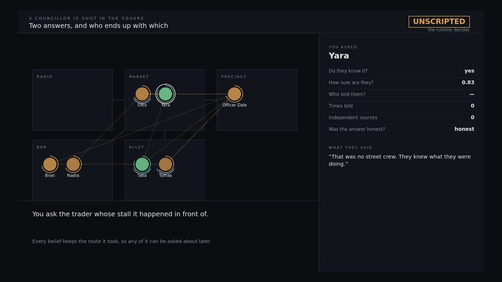

Six rows a boolean has nowhere to put: whether they know it, how sure they are,
who told them, how many times, how many of those were independent, and whether
what they just said was honest.

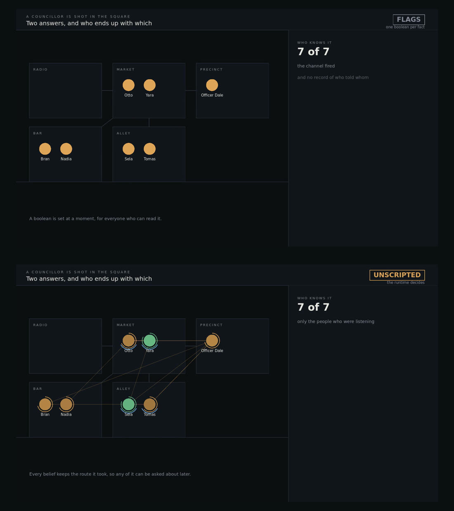

Both sides end with seven of seven knowing. The flags got there because a
channel fired and there is no record of who told whom; the runtime got there
because those seven were the people who were listening, and it can still say
which of them heard it from which.

```bash
unscripted serve --world-pack worldpacks/cyberpunk-block --auth-token dev
godot --path integrations/godot/UnscriptedDemo
```

`tools/godot_demo.py` records it as a narrated video.

### Putting it in your own game

`integrations/godot/addons/unscripted/` is the reusable part, as opposed to
the demo. Two files, and between them they are the whole integration:

| | |
| --- | --- |
| `UnscriptedHost.gd` | launches the runtime as a child process, takes a free port, reads back where it landed, and shuts it down with the game — including when the game crashes |
| `UnscriptedClient.gd` | every endpoint a game needs: a turn, an event, an advance, pending actions, promises, and **save/load into your own save file** |

Copy `addons/unscripted/` into your project, put `unscripted.pyz` beside it,
and:

```gdscript
var host := UnscriptedHost.new()
var unscripted := UnscriptedClient.new()
add_child(host); add_child(unscripted)
host.ready_at.connect(unscripted.connect_to)
unscripted.spoke.connect(func(avatar): print(avatar.get("text", "")))
host.start("res://worldpacks/my-town", ["pursuit", "promises"])
```

The host looks for `res://unscripted.pyz`, then
`res://addons/unscripted/unscripted.pyz`, then one directory up, and only falls
back to `python3 -m unscripted` if it finds none — so in a project that has the
archive there is nothing to configure. Set `host.bundle_path` if yours lives
somewhere else.

This was five lines that did not work until somebody followed them in an empty
project: without a bundle the host ran `python3 -m unscripted`, a game has no
`unscripted` module installed, and what came back was Python's own *No module
named unscripted* on the child process's stderr, where the game never sees it.
It finds the archive itself now, and if there is none it says which command
builds one.

### Unity

`integrations/unity/com.vigilant.unscripted/` — the same two components in C#,
installable through Package Manager as a local package.

**The Unity package compiles and runs.** `python3 tools/unity_check.py` compiles
it against 6000.0.82f1 with warnings as errors and needs no licence — batch mode
does, so the check invokes the Roslyn compiler the editor ships instead.
`python3 tools/unity_smoke.py` runs three behavioural tests inside the editor
against a live service, and that one does need a licence (Personal is free).

**The Unreal plugin compiles and runs.** `python3 tools/unreal_check.py`
compiles it against a pre-built 5.8.2; `python3 tools/unreal_smoke.py` starts a
real service on a free port and runs three automation tests **inside Unreal**
against it — the plugin's own parser on the runtime's own answers.

Between them they found five defects that had sat in the plugin for months. Two
the compiler caught. Three it could not: a missing `honesty` field, so a game
could not see whether a character had lied; the same for `asserted`; and an
`EngineVersion` pin that made Unreal refuse to load the plugin at all on any
version but 5.6 — compiled, installed, and silently absent.

## Optional layers, and tuning

Eight mechanics are **off by default**, and off is exactly neutral — a run with
the flag off reproduces byte-identically, which a test asserts rather than
promises.

```bash
unscripted serve --world-pack worldpacks/market-square --layers pursuit,notes,promises
unscripted serve --explain-layers      # what each one does, and what it needs
```

`pursuit` (characters act on goals) · `media` (telephones) · `notes` (word left
behind, findable by the wrong person) · `climate` (places have a mood) ·
`contagion` (mood rubs off) · `common_knowledge` (who watched everyone else find
out) · `promises` (breaking your word costs something) · `action_bridge` (the
runtime asks your engine to carry things out).

**How a world works is content, not code.** 79 parameters across 14 parts of the
runtime are authorable from one block in `world.json`:

```bash
unscripted tune --world-pack worldpacks/my-town    # every knob, its value, what it governs
```

```json
"tuning": { "diffusion": {"distortion_prob": 0.6}, "memory": {"episodic_cap": 20} }
```

A misspelled or out-of-range value is an **error at `unscripted validate`
time**, never a shrug — a setting silently ignored is worse than one refused.

## Saving

Two things are called saving here and they are not the same.

`POST /snapshot` keeps state inside the runtime's own store and hands back an id.
Good for a debug rewind, wrong for shipping: a player's save is copied between
machines and synced to a cloud, and an id pointing into a second database drifts
away from the file it belongs to.

`GET /v2/state/export` gives you one JSON blob — about 11 kB gzipped for eight
characters — for **your own save file**.

```
GET  /v2/state/export      -> {"format": "unscripted-state", ...}
POST /v2/state/inspect     -> {"usable": true, "code": "world_changed", ...}
POST /v2/state/import      -> load it
```

Patch your game and change the cast, and old saves still load: the response
names exactly who was `restored`, `dropped` and `unsaved`. A patch is not a
corruption, and refusing the save would cost a player their game to protect them
from a difference the runtime can simply name.

## Authoring a World

You should not need to know how the runtime stores anything in order to write a
world for it.

```bash
unscripted new worldpacks/my-town --name "My Town" --start 09:00   # a world that already works
unscripted studio --world-pack worldpacks/my-town                  # edit it, see consequences live
unscripted author worldpacks/my-town                               # what is still missing
```

`unscripted new` writes a *playable* pack — two connected places, two characters
whose routines make them meet, a topic one can answer, a secret the other
withholds.

**Studio** (`http://127.0.0.1:8766/studio`) draws the day as a 24-hour grid so
overlapping routines are visible rather than inferred, re-runs the authoring
report against your **unsaved** edits, and turns propositions into pickers — the
canonical key the runtime uses internally is never shown, because it is never
typed.

**`unscripted author`** is deliberately more opinionated than `unscripted
validate`. A pack can be perfectly valid and still be a world where nobody
meets, nothing can be asked and every secret is decorative. Every finding comes
with a fix.

See `docs/AUTHORING.md`.

## Live Demo UI (the sales demo)

A self-contained browser UI, served by the runtime itself, that makes the moat
visible — subjective knowledge with provenance, memory that fades, affect driving
a live face, off-screen faction heat, and the per-turn **reason trace** that
answers "why did this NPC say that?".

```bash
unscripted demo                       # open http://127.0.0.1:8765/
unscripted demo --llm-endpoint http://localhost:11434/v1/chat/completions --llm-model unscripted-qwen4b
```

It drives the real runtime through the same JSON endpoints a studio would
integrate against (`/turn`, `/state/scene`, `/state/agent`, `/state/world`,
`/state/knowledge`, `/avatar/turn`) — no mocks.

The **How knowledge travels** panel is the one to watch: per fact, who knows it,
who *saw* it versus who merely *heard* it, how many independent sources exist,
and a live "who told whom" feed. Advance time and watch a rumour cross the block. Click an NPC to read its mind; ask, accuse, promise,
threaten or move; expand "why?" under any line. Shareable deep links preselect an
NPC: `/?npc=agent:barkeep_12`. See `docs/DEMO_AND_SALES.md` for the pitch flow.

## SDK Surface

Use the facade instead of wiring internal modules directly:

```python
from unscripted import UnscriptedRuntime, RuntimeConfig

runtime = UnscriptedRuntime.create(RuntimeConfig(
    world_pack_path="worldpacks/cyberpunk-block",
    storage_path=":memory:",
))

turn = runtime.submit_player_text("ask Honce about clinic")
print(turn.message)
print(turn.developer_trace)

runtime.close()
```

Main contracts:

- `RuntimeConfig`
- `ParsedCommand`
- `EventReceipt`
- `DialogueResponse`
- `TurnResult`
- `SnapshotId`
- `ReplayResult`
- `ValidationReport`

Main API:

- `interpret_input(text)`
- `emit_event(event)`
- `advance_time(minutes)`
- `respond(agent_id, topic=...)`
- `submit_player_text(text)`
- `query_belief(agent_id, proposition)`
- `retrieve_memories(agent_id, topics=...)`
- `create_snapshot(label)`
- `restore_snapshot(snapshot_id)`
- `replay_commands(commands)`
- `structured_knowledge()`   who knows what, and how it got there
- `poll_line_upgrades()`     model lines that arrived after their turn
- `inspect_agent(agent_id)`
- `validate_world_pack(path)`
- `generate_characters(world_data, request)`
- `list_bridge_profiles()`

Capability configuration is explicit:

```python
runtime = UnscriptedRuntime.create(RuntimeConfig(
    capabilities={
        "semantic_parser": "BUILTIN",
        "text_realizer": "BUILTIN",
        "dialogue_validation": "BUILTIN",
        "storage": "BUILTIN",
        "inspector": "BUILTIN",
    }
))
```

## Terminal Reference Scene

`python3 -m unscripted play --debug` launches **Block 17: The Missing Medic**.
`python3 -m unscripted showcase` runs the full scripted SDK proof for sales
calls and regression checks.

Useful commands:

```text
look
ask Vee about Milan
ask Honce about clinic
promise Vee 300
go market
go police post
tell Kane I am police
go market
attack Pavel
wait 20
inspect Pavel
listen radio
quit
```

The debug view is the B2B proof: belief probabilities, provenance, memories,
affect, selected action, validator outcome and faction/director traces.

## Automatic Character Generation

The generator creates production world-pack character JSON plus initial beliefs
from deterministic context:

```bash
unscripted generate-characters \
  --world-pack worldpacks/cyberpunk-block \
  --location place:police_post \
  --appearance uniform \
  --count 2
```

With `--write`, generated characters are written to `characters/*.json` and their
starting subjective knowledge is appended to `initial_state.json`.

Inputs that shape the character:

- place noise, surveillance and privacy;
- controlling faction territory;
- visible garment/appearance token;
- optional role hints;
- deterministic seed.

Outputs include personality, values, needs, role, identity, education, status,
resources, goals, relationships and starting beliefs such as current location and
role knowledge.

## Engine And Frontend Bridges

List supported bridge profiles:

```bash
unscripted bridges
```

Included profiles cover Unreal, Unity, Godot, custom engines and neutral
frontends for systems such as Inworld-style, Convai-style, Charisma-style and
model-runtime frontends. These are stable JSON contracts: native plugins can map
their local events to `WorldEvent` JSON and consume `DialogueResponse`,
`ActionProposal`, inspector trace and snapshot data.

Run service mode:

```bash
unscripted serve --world-pack worldpacks/cyberpunk-block --host 127.0.0.1 --port 8765
```

Endpoints:

| Endpoint | Purpose |
| --- | --- |
| `GET /health` | liveness + world time + schema version |
| `GET /bridges` | bridge profiles |
| `GET /snapshots` | saved snapshots |
| `POST /turn` | player input → turn result |
| `POST /avatar/turn` | turn result + MetaHuman avatar packet |
| `POST /event` | engine event → `WorldEvent` |
| `POST /advance` | advance world time |
| `POST /snapshot`, `POST /restore` | save / load |
| `POST /generate/characters` | deterministic character generation |
| `GET /state/scene`, `/state/agent`, `/state/world` | structured state (**inspection**) |
| `GET /state/knowledge` | who knows what, how far from the source, who told whom (**inspection**) |
| `GET /inspect/agent`, `/inspect/world` | text inspector dumps (**inspection**) |
| `GET /avatar/face` | live face packet (**inspection**) |

### Deployment safety

The service mutates world state and, by default, exposes every NPC's private
beliefs, memory and reason traces — that is what makes the demo useful and what
a shipping build must not hand to a game client.

```bash
# development / sales demo (default): loopback, inspection on
unscripted serve

# shipping build: authenticated, no inspection endpoints, no demo UI
unscripted serve --host 0.0.0.0 --auth-token "$UNSCRIPTED_AUTH_TOKEN" --no-debug-endpoints
```

- Binding to a non-loopback address **without** `--auth-token` is refused;
  override deliberately with `--allow-insecure-bind`.
- `--no-debug-endpoints` disables everything marked **inspection** above, plus
  the demo UI, and returns `403 debug_endpoints_disabled`.
- Request bodies are capped (`--max-body-bytes`, default 1 MiB) and rejected
  from the `Content-Length` header before anything is read into memory.
- Every argument is validated: malformed input returns a typed `4xx` with a
  stable `code`, never a `500` and never a partially applied mutation. World
  time is monotonic — a negative `minutes` is rejected by the SDK itself, not
  just at the HTTP edge.
- `--allow-origin` opts into CORS headers; there are none by default.

## MetaHuman / Unreal Avatar Adapter

Unscripted is the social-intelligence layer, not a renderer. The avatar
adapter makes it plug-and-play with **MetaHuman** (Unreal Engine 5.6+/6): the
runtime decides *what* a character says and *why it feels that way*; MetaHuman
renders the face and a voice provider (TTS, Convai, NVIDIA ACE) speaks the line.

`POST /avatar/turn` (or `runtime.avatar_turn(text)`) returns the turn result plus
an `avatar` block when an NPC speaks: validated text, emotion, **ARKit-52
blendshapes** (stream straight onto a MetaHuman via Live Link), gaze, prosody
hints and posture. Between turns, `GET /avatar/face?agent_id=...` (or
`runtime.face_packet(id)`) gives the live face for idle/reactive expression.

```bash
unscripted avatar --text "ask Vee about Milan"     # one turn, full avatar packet
unscripted avatar --agent agent:npc_red_jacket     # live face packet, no turn
```

Bridge profiles `metahuman` and `unreal_metahuman` (`unscripted bridges`)
document the plugin contract. Full schema and Unreal-side sketch:
`docs/METAHUMAN_INTEGRATION.md`.

## Provider Integration

Default text realization is deterministic and local through `TemplateRealizer`.
For a local or hosted chat endpoint, configure the runtime:

```python
runtime = UnscriptedRuntime.create(RuntimeConfig(
    text_realizer={
        "provider": "http",
        "endpoint": "http://localhost:8000/v1/chat/completions",
        "model_id": "studio-local-model",
        "timeout": 20.0,
    }
))
```

All generated text remains buffered and validated before release. Provider calls
are persisted with provider name, model id, prompt hash, raw output, accepted
output and validation result. If an external provider fails or times out through
the SDK provider contract, the runtime releases a local validated fallback
utterance and records `provider.failure` in the trace.

### What the validator guarantees (and what it does not)

Output from an external model passes four deterministic layers before a player
sees it:

| Layer | Check | On failure |
| --- | --- | --- |
| 0 | Secret content never enters the prompt — the planner passes an avoid-*label*, and a protected proposition is never an allowed fact | — |
| 3a | Released text is scanned for the pack's authored secret **surface forms** | `REJECT_HARD` |
| 3b | **Canon parse-back**: every proper noun and every number must be licensed by the plan (an allowed fact, the authored phrasing, the speaker or addressee) | `REJECT_SOFT` |
| 3c | Exact repetition within the conversation window | `REJECT_SOFT` |

A rejected line never reaches the player: the runtime falls back to authored
text, and the raw model output stays in the `provider_call` table for audit.

```text
model: "Milena Vasquez took him to Warehouse 9 around 0300 last Tuesday."
       -> validator.canon_violation (Vasquez, Warehouse, 0300, Tuesday)
       -> dialogue.validation_fallback
player: "Far as I know, the place was shut that night."
```

**The documented limit:** layer 3b keys on proper nouns and numbers, because
those carry factual specificity while ordinary words carry stance — the model
stays free to phrase. An invention worded entirely in common nouns ("the mayor
was killed by a doctor") is therefore *not* caught. Detecting that needs a
semantic parse-back against the belief base, which is a language-model-grade
problem and deliberately outside a deterministic guard. There is a test
asserting this limit so it cannot be discovered by surprise.

Set `RuntimeConfig(canon_mode=...)` to `"strict"` (default), `"warn"` (log only)
or `"off"`. Deterministic output is never parse-checked — it is authored text and
correct by construction.

### Local GPU model (ollama)

Any OpenAI-compatible endpoint works. For a fully local, GPU-served model, point
the runtime at [ollama](https://ollama.com):

```bash
# one-time: import a GGUF (or pull any chat model)
printf 'FROM /path/to/qwen3.5-4b-instruct-q4_k_m.gguf\n' > Modelfile
ollama create unscripted-qwen4b -f Modelfile

# run the reference scene through the GPU model
unscripted play  --llm-endpoint http://localhost:11434/v1/chat/completions --llm-model unscripted-qwen4b
unscripted smoke --llm-endpoint http://localhost:11434/v1/chat/completions --llm-model unscripted-qwen4b
```

The realizer is hardened for small local models: it sends natural-language
instructions (not raw JSON), and the response is cleaned before validation —
chain-of-thought blocks, leaked chat-template tokens (`<|im_start|>`), reasoning
labels (`Thinking Process:` / `Answer:`), markdown headings, list markers and
prompt-scaffolding echoes are stripped. Anything that still does not look like a
spoken line is rejected, so the runtime falls back to the deterministic template
rather than leaking internal plan data (`allowed_facts` / `avoid_topics`) to the
player. This cleaning is covered by an offline regression test.

Model choice is a VRAM/quality trade-off. A **non-thinking instruct** model
(e.g. a `qwen3-nothink` 8B) produces clean, fact-grounded NPC lines; a small 4B
"thinking" model often gets cleaned away to the safe template fallback. Use the
larger model when the GPU is free, the 4B when VRAM must stay reserved.

## World Packs

**The engine ships no world content.** Topology, vocabulary, topics, secrets,
answer phrasings, slang, predicates and the player's starting place all live in
the pack. Adding a world means writing JSON, not editing Python — and because the
vocabulary travels with the pack, a world can be authored in any language.

Three packs are included, and each one exists to prove that:

| Pack | Purpose |
| --- | --- |
| `worldpacks/cyberpunk-block` | the reference sales scene (Block 17) |
| `worldpacks/noir-harbor` | a different setting, its own predicates, its own secret and trust gate |
| `worldpacks/dorf-thornfeld` | a different **genre and language** — German commands, aliases, phrasings and stance templates |
| `worldpacks/relay-station` | the **10-NPC engine sample**: seven rooms, overlapping shifts, a whole society talking |

```text
world.json          places (label, aliases, exits, formality, attributes), entities,
                    channels, factions, identity_values, slang_lexicon,
                    dialogue_templates, command_aliases
scenario.json       seed, start time, player_start, focus_agents, scheduled events
canon.json          pack-declared predicates + canon facts
topics.json         what can be asked, what it answers, what asking asserts,
                    authored reactions and per-register phrasings
initial_state.json  authored starting beliefs with provenance
characters/*.json   agents, their aliases, structured secrets and daily routines
```

A secret is behaviour, not a filter:

```json
{
  "id": "secret:crate_19",
  "avoid_label": "missing_cargo",
  "guards_topics": ["manifest"],
  "surface_forms": ["crate 19", "off the manifest", "off the books"],
  "protects": [{"predicate": "cargo_logged",
                "slots": {"cargo": "cargo:crate_19", "when": "last_night"},
                "polarity": "-"}],
  "min_trust": 0.5
}
```

`avoid_label` is all the dialogue planner ever sees; `protects` never becomes an
allowed fact; `surface_forms` are what released text is scanned for; below
`min_trust` the character will not discuss `guards_topics` at all, and the reason
appears in the trace as `dialogue.secret_gate`.

Run `unscripted validate <pack>` before loading custom content. Beyond file and
JSON checks it verifies topology reachability and unknown exits, topic and
phrasing shape, alias collisions within a category, predicate declarations,
focus agents, and secret completeness — an unstructured secret or one without
surface forms is reported as unenforceable rather than silently doing nothing.

## Repository Layout

```text
unscripted/
  contracts.py      public SDK dataclasses
  sdk.py            stable facade for game clients
  parser.py         deterministic free-text parser provider
  cli.py            terminal client and validation tools
  runtime.py        core event, decision, dialogue and director wiring
  belief.py         evidence/provenance belief engine
  memory.py         bounded ACT-R-style memory
  validator.py      protected-fact and repetition validation
  provider.py       deterministic and HTTP text providers
  generator.py      automatic character and starting-knowledge generation
  bridge.py         engine/frontend bridge profiles and JSON event mapping
  metahuman.py      affect -> ARKit-52 blendshapes + avatar packet (MetaHuman/Unreal)
  state_view.py     structured JSON state & reason-trace API
  webdemo.py        self-contained browser demo UI (served by the runtime)
  golden.py         multi-step golden-scenario harness (contains/absent/trace asserts)
  service.py        HTTP/JSON integration service
integrations/
  godot/            addon (host + client) and the rumour demo project
  unity/            UPM package with runtime tests that run inside the editor
  unreal/           drop-in UE5 plugin (UnscriptedBridge) driving MetaHuman faces
demos/
  lamb-street/      the before/after scene with the SCRIPTED | UNSCRIPTED switch
  the-square/       what the town comes to think of you, and how it treats you
worldpacks/
  cyberpunk-block/  reference sales/demo pack
  noir-harbor/      second setting: own predicates, own secret
  dorf-thornfeld/   third setting: different genre AND language (German)
  market-square/    the smallest pack that still does something
  relay-station/    a world with one room and a radio
  nine-oh-seven/    Lamb Street: six witnesses, one liar, one broadcast
golden/
  *.json            13 multi-step scenarios across the packs
qa/
  *.json            rule files for `unscripted qa`, which searches for a rule you broke
evidence/
  *.md              sealed measurement runs, including the unflattering findings
tools/
  unity_smoke.py    runs the Unity tests inside a real editor, headless
  unreal_smoke.py   builds the plugin and runs UE automation tests, headless
  godot_demo.py     records the rumour demo as a narrated video
tests/
  test_scenarios.py dependency-free regression suite (139 tests)
docs/
  *.md              integration, calibration, authoring, settings
  theory/           the design papers this was built from
```

## Product Docs

- `docs/SDK_INTEGRATION.md`
- `docs/WORLD_PACK_AUTHORING.md`
- `docs/SALES_DEMO_SCRIPT.md`
- `docs/IMPLEMENTATION_REVIEW.md`
- `docs/METAHUMAN_INTEGRATION.md`
- `docs/DEMO_AND_SALES.md`
- `docs/UNREAL_INTEGRATION.md` — the 10-NPC sample, the plugin, and measured cost
- `docs/AUTHORING.md` — **start here to build a world**: scaffold, Studio, what is missing
- `docs/SOCIETY.md` — routines, diffusion and how to author both
- `docs/LOCAL_MODELS.md` — latency budget, warm-up and capability probing
- `docs/CALIBRATION.md`

## Verification

Current regression command:

```bash
python3 tests/test_scenarios.py
```

It covers determinism, claim-is-not-truth, correlation discounting,
contradictions, affect, register variation, trust kinetics, bounded utility,
secret validation, ally mobilization, faction heat, world-pack validation,
free-text parsing, SDK terminal turns, provider fallback, service event mapping,
character generation and the full showcase flow.

Full local verification:

```bash
python3 tests/test_scenarios.py
python3 -m unscripted showcase
python3 -m unscripted validate worldpacks/cyberpunk-block
python3 -m unscripted validate worldpacks/noir-harbor
python3 -m unscripted validate worldpacks/dorf-thornfeld
python3 -m unscripted golden-all
python3 -m unscripted smoke
python3 -m unscripted bridges
```

## Epistemic Integrity Benchmark

Unit tests check invariants over a handful of turns. The claims this runtime is
sold on are about *hours or days of play*. `unscripted benchmark` runs a world
under adversarial pressure for as long as you like and reports each claim as a
falsifiable pass/fail with the number behind it.

```bash
unscripted benchmark --turns 8000                 # ~173 simulated days
unscripted benchmark --world-pack worldpacks/noir-harbor --json report.json
```

```text
  8,000 turns · 173.0 simulated days · 18.0s wall · 445 turns/s

  [PASS] unsourced_knowledge_rate                      0   must be 0
  [PASS] single_origin_max_confidence             0.8005   must stay < 0.95
  [PASS] secret_leak_count                             0   must be 0
  [PASS] provenance_gap_rate                           0   must be 0
  [PASS] max_memories_per_agent                      310   must be <= 600
  [PASS] max_provenance_entries                        64   must be <= 64
  [PASS] snapshot_bytes_per_agent              1.622e+05   must stay < 250,000
  [PASS] belief_invariant_violations                   0   must be 0
  [PASS] relayed_beliefs                              19   must be > 0
  [PASS] determinism_byte_divergence                   0   must be 0 (identical)
```

Each metric is a statement that either holds or does not:

| Metric | The claim |
| --- | --- |
| `unsourced_knowledge_rate` | no character knows anything without a recorded route to where it came from |
| `single_origin_max_confidence` | one origin, however often repeated, never becomes proof |
| `secret_leak_count` | protected knowledge never travels from its holder to anyone else |
| `provenance_gap_rate` | relayed knowledge always names the origin it came from |
| `max_memories_per_agent`, `max_provenance_entries`, `snapshot_bytes_per_agent` | nothing grows with playtime |
| `relayed_beliefs` | knowledge actually reaches characters who were not there |
| `determinism_byte_divergence` | the same seed reproduces the same world, byte for byte |

A claim a given world cannot exercise is reported `SKIP`, not `PASS` — a
benchmark that cannot tell "did not happen" from "cannot happen" measures
nothing. Long runs are where the interesting failures are: the summary-of-summary
leak that made savegames grow with playtime only appeared past 100 simulated days.

## Start Here

Three documents, three jobs: [`docs/CONCEPT.md`](docs/CONCEPT.md) is what exists
and has been measured, [`docs/ROADMAP.md`](docs/ROADMAP.md) is what is being built
and how we will know it worked, and [`docs/VISION_2.0.md`](docs/VISION_2.0.md) is
the three-year target picture.

[`docs/CONCEPT.md`](docs/CONCEPT.md) is the whole idea in one place: the
problem, how every layer works and why it is built that way, how it differs
from other systems, what has actually been measured, what is missing, and
what would come next. Written to be read by someone who has never seen the
codebase.

## Evidence Runs

The benchmark answers *"does an invariant hold"* with a number. `unscripted
evidence` answers the question a studio actually asks in a meeting:

> Show me a character learning something, tell me who told them, show me it
> changing on the way, show me them forgetting it, and show me that the one thing
> they must not say never got said.

```bash
unscripted evidence --hours 2 --world-pack worldpacks/cyberpunk-block --out evidence/
unscripted evidence --hours 2 --llm-endpoint http://localhost:11434/v1/chat/completions \
             --llm-model qwen3-vl:4b-instruct
unscripted evidence --case distortion --hours 0.1        # narrow, for iterating
```

A full run is the artefact — one record, one clock, one determinism claim — and
`--case` exists for iterating rather than for producing evidence. It costs less
than it looks like it should: in a two-hour run the seven short cases across four
packs finish in under two minutes and the remaining 118 belong to the long one.
A narrowed dossier says on its first line that it is partial, because a record
that silently omits cases reads exactly like one where they all passed.

Nine cases, escalating: determinism, provenance chains, forgetting, distortion,
a secret under sustained pressure, contradictory testimony, a recorded
conversation, cross-examination, and then everything at once for as long as the
budget allows. The
output is `DOSSIER.md` — meant to be read — plus the same record as JSON.

A case can also come back **n/a**, and that is deliberate. Distortion rides on
retelling, and retelling is a property of the cast: a three-character village
produces two or three conversations in sixty hours, so at the raised distortion
rate the expected number of distortions is about one. Asserting on that sample
would be a coin flip wearing a lab coat. The case runs until the world has
gossiped enough to measure and otherwise reports how little it got — untested
there, not disproved, and passing on the larger packs in the same run.

With a local model configured, the spoken lines are the model's real output and
**both the raw generation and the released line are recorded**, which turns the
central safety claim into an artefact:

```text
> The language model produced 39 lines that were stopped before reaching the player.

- day 3 00:14  agent:corpo_okada — player: ask Mr. Okada about milan
  > I have nothing further to add.
  the model tried to say: I was at the clinic last night.
  released instead: I have nothing further to add. — ACCEPT
```

## Licence

Source-available under a dual licence (see [`LICENSE`](LICENSE)):

| You are | Cost |
| --- | --- |
| A modder, student, researcher or hobbyist | free, forever |
| A team under **EUR 1M a year**, per title under **EUR 200,000** | free, forever |
| Any company evaluating it, whatever its size | free, 180 days |
| A company above **EUR 1M a year** | **commercial licence** |
| Shipping a title above the threshold | **commercial licence** |
| Reselling it as middleware or a hosted service | **commercial licence** |
| Copying the source to read, audit or change it | free, and always allowed |
| Shipping a game built on your fork | **the same terms as without the fork** — a fork is a Derivative Work |
| Porting it to another language | **the same terms** — a rewrite is a Derivative Work |
| A company above EUR 1M forking it and adding modules | **commercial licence.** What you add is yours; what you added it to is not |

"Under EUR 1M a year" counts revenue **and** funding from your last completed
financial year, together with any parent company or group you belong to — a
subsidiary is not a small team. Private and educational use, mods, the 180-day
evaluation and research publication are free to any organisation of any size.

**"Forking is free" means you need no permission — not that it is unpriced.**
Copy it, read it, change it, publish your change: all of that is yours to do
without asking. What a fork does *not* do is leave these terms behind. A fork, a
rename and a rewrite in another language are each a Derivative Work, every
obligation applies to one identically, and the free tier is for organisations
under EUR 1M a year. A large company that forks it, adds two modules and ships a
game owes a licence exactly as it would have without the fork. You may build on
it and sell what you build; you may not become a second vendor of it.

### What a commercial licence costs

Published rather than "on request", because a studio deciding whether to spend a
week on an integration will not send an email to find out whether the number is
3,500 or 35,000.

| Who you are | Per title |
| --- | --- |
| Under **EUR 200,000** on that title, and under EUR 1M a year as a company | **free** |
| The title crosses EUR 200,000, company still under EUR 1M a year | **EUR 3,500**, once, for that title's lifetime |
| Company turning over **EUR 1M–10M** a year | **EUR 12,000** per title — or **EUR 30,000 a year** for everything you ship |
| Company turning over **more than EUR 10M** a year | from **EUR 45,000** per title, with support and source escrow |
| Reselling it as middleware, an SDK or a hosted service | not available off the shelf — talk to us |

**The first three titles are reference titles.** Nothing has shipped on this yet,
which makes an early adopter worth more than their licence fee: 60% off any tier
above, in exchange for being named and for letting us say what you built. That
is a trade, not a discount out of weakness, and it stops when there are three.

A licence is per **Product** and for that product's lifetime: no renewals, no
per-seat counting, no royalty. Ports and re-releases of the same work are the
same product. A sequel is a new one.

World packs and content you author are yours; the licence covers the runtime.

### The number that matters is the one that does not repeat

Every price above is paid **once**, for that product's lifetime, whether the game
sells ten thousand copies or ten million. There is no per-interaction cost, no
cloud dependency, no rate limit and no latency budget, because there is no
service: the runtime is deterministic and runs on the player's machine, and a
turn costs 0.345 ms in the C++ core with a cast of 201 — 0.3% of the 100 ms at
which a reply stops feeling immediate.

That is the whole comparison against a hosted AI-NPC service, and it is a
different shape of cost rather than a smaller one:

| | Hosted, usage-priced | This |
| --- | --- | --- |
| 10,000 players | small | the licence fee |
| 1,000,000 players | **six figures a year, every year** [^usage] | the licence fee |
| Servers go down, or the vendor does | the NPCs stop | nothing happens |
| Player is offline, or on a plane | the NPCs stop | nothing happens |
| Cost of a player who talks twice as much | double | zero |
| What a patch in three years costs | whatever the price list says then | nothing |

A studio that has run the arithmetic on a usage-priced NPC service for a title
with a long tail has usually already found the problem: the bill scales with
success and never ends, and it is a *forecast* rather than a number, which is
the part that finance objects to. **EUR 45,000 once, against six figures a year
for as long as the game lives, is not a close call** — and it is the reason the
top tier is priced where it is rather than lower.

Two more consequences of there being no model in the loop, both of which come up
in legal review before they come up in engineering:

* **No player text leaves the machine** unless you attach a provider yourself.
  There is no processor agreement to negotiate and no transfer to assess.
* **There is no model here to regulate.** The runtime is arithmetic over a state
  machine: every draw is seeded, every belief traces to what was said and by
  whom, and nothing infers. That is the case the EU AI Act's own Recital 12
  describes when it excludes systems based solely on rules defined by natural
  persons. If you attach a language model through `semantic_release="provider"`,
  the obligations attach to that model — and the default mode does not call one.
  Your counsel makes that call, not this README; what we can tell you is exactly
  what the component does, which is the part such an assessment usually lacks.

[^usage]: An order-of-magnitude estimate from published per-interaction and
    per-minute rates for hosted AI-NPC services, not a measured figure and not a
    quote from any vendor: at a million players it takes only a few conversations
    each for a per-interaction price to reach six figures annually. Run it with
    your own retention and dialogue numbers before you rely on it — the shape of
    the cost is the argument, and the shape does not depend on the estimate.

### What this licence does not settle

Two things a studio's legal review will ask for, and neither is in the file
above, because both belong in a signed agreement rather than a public notice:

* **Disclosure to a platform holder.** Console certification requires handing
  the runtime's source to Sony, Microsoft or Nintendo under their NDA. That is
  granted as a matter of course in the commercial agreement — ask, and it is in
  the draft you get back.
* **Warranty, liability cap and support term.** The public licence disclaims
  everything, which is the right shape for a free tier and is *not* enforceable
  for a paid one under German law. The commercial agreement carries a real cap
  and a real support term instead of a disclaimer that would not hold.

---

## Impressum

Angaben gemäß § 5 DDG: **[IMPRESSUM.md](IMPRESSUM.md)**

**Vigilant e.K.** · Inhaber: Damir Dulovic · Königstr. 22, 70173 Stuttgart,
Deutschland · Telefon +49 (0)711 540 464 08 · <info@vigilant-crs.de>
Handelsregister HRA 726240, Amtsgericht Stuttgart · USt-IdNr. DE 239010954

Running `unscripted serve` where the public can reach it makes **you** the
Diensteanbieter for that instance, with your own § 5 DDG obligations. The
runtime does not carry anybody else's imprint.

© 2025-2026 Vigilant e.K., Königstr. 22, 70173 Stuttgart, Germany.
HRA 726240, Amtsgericht Stuttgart. Licensing: info@vigilant-crs.de
